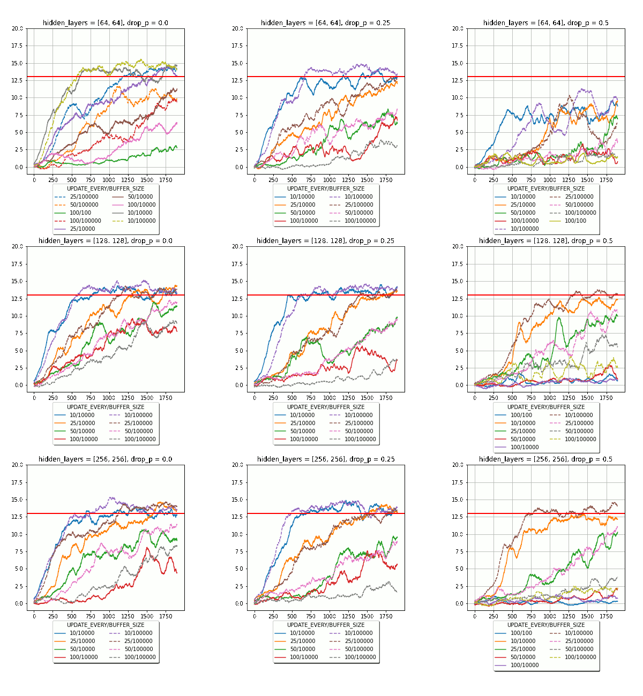
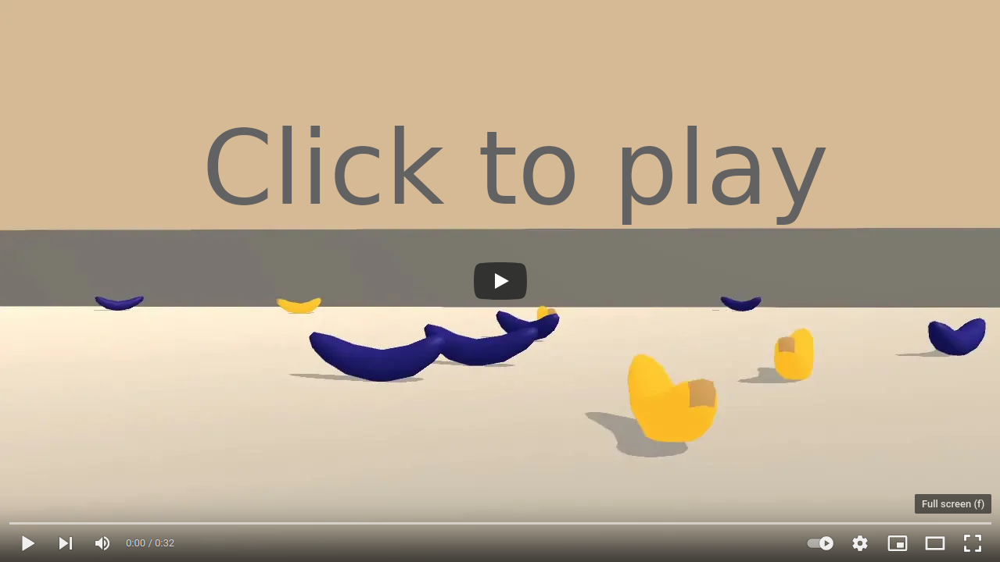

# Porject Report Navigation
The project was impemented in **Navigation.ipynb** starting from block __4.1 My Turn__ and can be devided in tree parts
* Finding and comparing suitable parameters. _(Code Block 4.1 - 4.6)_
* Re-training of a selected network with good parameters for demonstration purposes. _(Code Block 4.7 - 4.8)_
* Live Demo of a selected network. _(Code Block 4.9 - 4.10)_
## Learning Algorithm
For this project I used a DeepQNetwork with a replay buffer similar to the _Lunar Landing example_.
In order to find suiting parameters,  I generated with the _Code Block 4.1 - 4.6_ the following figure showing average scores over the last 100 scores.
The first row shows a network with two hidden layers of [64,64] followed by [128,128] and in the last row [256,256] neurons and the column with dropout rates of 0.0, 0.25 and 0.5.
The plots itself are showing the average score using Replaybuffer of 100, 10000 and 100000 with updates as shown in the legend. The buffer size of 100 and an update every 100 should represent the use of not Replaybuffer.

Depending on the setting, I was able to train the network within 500 episodes to gain an average result of 13 using two hidden layers with each 256 neurons and a replay buffer with a high update rate.
## Plot of Rewards
The plots and data generated in the first part _(Code Block 4.1 - 4.6)_ suggested that the following configuration suites the requirmentes best.

### hyperparameter and model architectures
* two hidden layers 
* ReLU activation function
* each with 256 neurons and 
* a drop-out rate of 0.25 works well with a 
* replay buffer size of 100000 and an 
* update every 10 state actions cycles

### Traning

For the training, I used a

* discount factor of GAMMA=0.99
* learning ragte of LR=0.0005
* batch size BATCH_SIZE = 64
* 
Therefore this parameter are trained again an plotted in more detail in _(Code Block 4.7 - 4.8)_

@drop-out rate
The data suggested that it makes only sense on bigger networks such like two hidden layers with each 265 neurons.

### Result

Click on the image to watch the result of my trained network.

## Ideas for Future Work

* I would like to test networks with more layers of different sizes, but time is currently for me expensive :-).
* Since I used the lunar lander network implantation as base it was easy to use the replay buffer, but It would make sense to test also a implementation without it. Currently I tried only reducing the replay buffer and update rate to mimic a system without replay buffer.
* Tuning GAMMA, LR and BATCH_SIZE was not needed since I received always a score of 13 with one of my solutions, but of course these parameters can be optimized.

## Suggestions for the Exercise

Currently, it is not clear what the feature vector represents and my questions in the forum was not answered. This is sad because it would make sense to get this information to get a better feeling on the problem.

